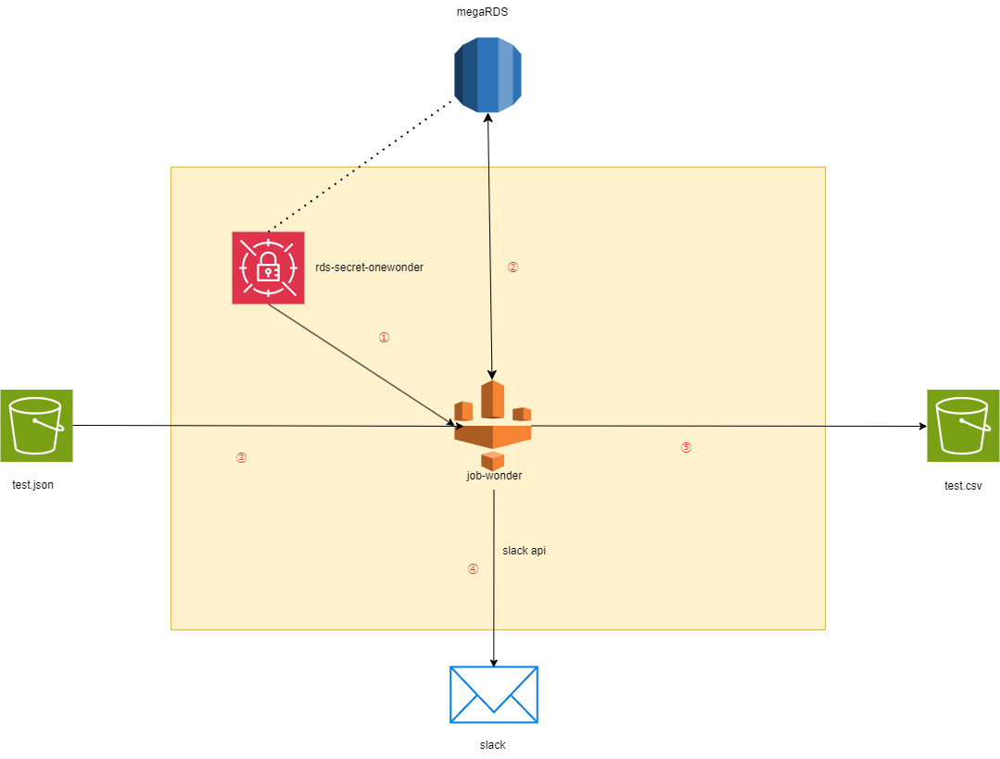
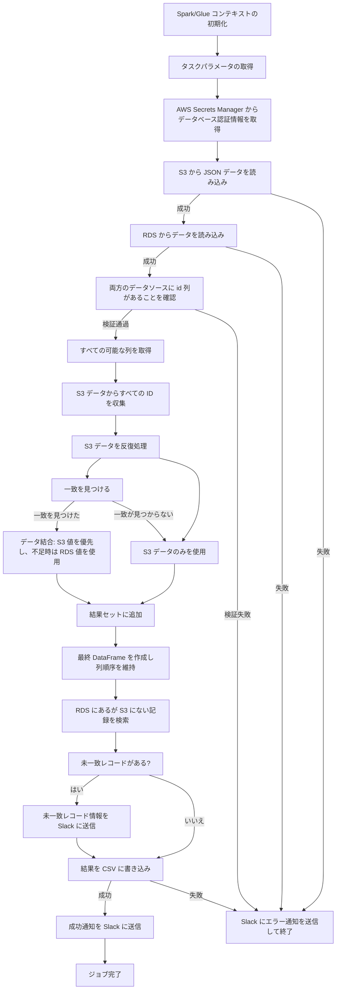

- [OneWonder](https://next.onewonder.co.jp/) はクラウドコンピューティングに特化したサービスを提供しています

## 使用技術一覧


 
 ## プロジェクト名

rds-glue-s3-etl-pipeline


## プロジェクト概要

本プロジェクトは AWS Glue（PySpark）をデータ処理エンジンとして活用し、AWS Secrets Manager でデータベース認証情報を安全に管理しています。また、Webhook 経由で Slack 通知機能を統合し、完全な自動データ処理と監視フローを実現しています。このアーキテクチャは、JSON データとリレーショナルデータベースのデータを定期的に統合し、特定の形式を維持する必要があるシナリオに最適です。

## アーキテクチャ図

- [glue.drawio](docs)



### 処理フロー

① **データセキュリティ**: シークレットマネージャー（rds-secret-onewonder）からデータベース認証情報を取得し、中央の job-wonder 処理コンポーネントに渡します。</br>
② **データベース接続**: 取得した認証情報を使用して上部の megaRDS データベースに接続し、データを読み取ります。</br>
③ **入力データ取得**: 左側の S3 バケットから test.json ファイルを入力データソースとして読み取ります。</br>
④ **状態通知**: 下部に接続されている Slack API を通じて、処理状態と結果通知を Slack に送信します。</br>
⑤ **出力データ保存**: 処理完了後、結果データを test.csv 形式で右側の S3 バケットに出力します。</br>

全体のプロセスは黄色の枠（Terraform 化にする）内で実行され、中心の Glue(job-wonder)がすべてのデータフローと変換操作を調整・処理します。

## Glue 論理処理フロー

- [gule_test_job.py](gule_test_job.py)



## プロジェクト構成

本プロジェクトは以下の主要コンポーネントで構成されています：

### 1. Glue ETLジョブスクリプト
- `gule_test_job.py` - データ処理ロジックを含むPythonスクリプト
  - SparkとGlueコンテキストの初期化
  - S3からのJSONデータ読み込み
  - RDSからのデータ読み込み
  - データの結合と処理
  - 結果のCSV出力
  - Slack通知の送信

### 2. Terraformの設定ファイル
- `main.tf` - AWSリソースの定義
  - AWS Secrets Managerリソース
  - Glue接続設定
  - Glueジョブ定義
- `data.tf` - 設定とデータ関係の処理
  - configs.jsonの読み込みと解析
  - common_settings.jsonの読み込みと解析
  - 接続URLとパスマッピングの生成
- `backend.tf` - Terraformバックエンドの定義
  - AWSプロバイダー設定
  - S3状態ストレージ設定

### 3. 設定ファイル
- `configs.json` - メイン設定ファイル
  - データベース接続情報
  - S3パス設定
  - Slack Webhook URL
- `common_settings.json` - 共通設定
  - Glueワーカー設定
  - ネットワーク接続設定
  - JDBCドライバー設定

### 4. CI/CD設定
- `.github/workflows/terraform.yml` - GitHub Actionsワークフロー
  - 自動デプロイプロセス
  - スクリプトのS3へのアップロード
  - Terraformの初期化と計画

## 主要機能の詳細

### 1. データ読み込みと検証
```python
# S3からJSONデータを読み込む
try:
    response = s3_client.get_object(Bucket=source_bucket, Key=source_key)
    json_data = json.loads(response['Body'].read().decode('utf-8'))
    s3_pd_df = pd.DataFrame(json_data)
    # データ検証...
except Exception as e:
    # エラー処理...
    
# RDSからデータを読み込む
try:
    maria_df = glueContext.create_dynamic_frame.from_options(
        connection_type="mysql",
        connection_options={
            "connectionName": connection_name,
            "dbtable": table_name,
            "database": db_name,
            "useConnectionProperties": "true"
        }
    ).toDF()
    # データ処理...
except Exception as e:
    # エラー処理...
```

### 2. データ結合ロジック
ETL処理の核心はS3とRDSデータのスマートな結合です：
- S3データを主要データソースとして扱う
- ID列をマッチングキーとして使用
- S3の値を優先し、不足している場合はRDSの値を使用
- S3にのみ存在するレコードは直接追加
- RDSにのみ存在するレコードは記録して通知

### 3. エラー処理と通知
Slack通知メカニズムが統合されており、様々なシナリオに対応します：
- データ読み込み失敗
- データ形式の不正
- 処理の正常完了
- 未マッチングレコードの発見

## Terraformリソース管理

```hcl
# 各設定用にSecretを作成
resource "aws_secretsmanager_secret" "rds_secrets" {
  for_each = local.configs
  name     = "rds-secret-${each.key}"
}

# データベース接続を作成
resource "aws_glue_connection" "mariadb_connection" {
  for_each = local.configs
  name     = "connection-${each.key}"
  # 接続プロパティ...
}

# Glueジョブを定義
resource "aws_glue_job" "gule_test_job" {
  for_each          = local.configs
  name              = "job-${each.key}"
  # ジョブ設定...
  
  default_arguments = {
    # パラメータ設定...
  }
}
```

## 設定ファイル構造

### configs.json
```json
{
  "configs": {
    "onewonder": {
      "SecretsManager": {
        "username": "db_username",
        "password": "db_password",
        "table_name": "table_name",
        "db_name": "database_name"
      },
      "S3": {
        "source_bucket": "source-bucket",
        "source_key": "input.json",
        "destination_bucket": "destination-bucket",
        "destination_file": "output.csv"
      },
      "slack": {
        "slack_webhook": "https://hooks.slack.com/services/xxx/yyy/zzz"
      },
      "Database": {
        "endpoint": "db-endpoint.region.rds.amazonaws.com",
        "dbtype": "mysql",
        "port": "3306"
      }
    }
  }
}
```

### common_settings.json
```json
{
  "Glue": {
    "worker_type": "G.1X",
    "number_of_workers": 2,
    "timeout_minutes": 2880,
    "glue_version": "5.0"
  },
  "connection": {
    "security_group_id": "sg-xxxxxxxxxx",
    "subnet_id": "subnet-xxxxxxxxxx",
    "availability_zone": "region-1a",
    "jdbc_driver": {
      "class_name": "org.mariadb.jdbc.Driver",
      "jar_uri": "s3://bucket/driver.jar"
    }
  }
}
```

## デプロイプロセス

### 手動デプロイ
1. リポジトリのクローン
   ```bash
   git clone <repository-url>
   ```

2. 設定ファイルの更新
   - `configs.json`と`common_settings.json`を編集

3. Terraformの初期化
   ```bash
   terraform init
   ```

4. デプロイの実行
   ```bash
   terraform plan
   terraform apply
   ```

### 自動デプロイ (GitHub Actions)
プロジェクトにはGitHub Actionsワークフローが設定されており、コードプッシュ時に自動実行されます：
1. コードのチェックアウト
2. PythonスクリプトをS3にアップロード
3. Terraformの初期化
4. Terraformプランの実行

## トラブルシューティングガイド

### 一般的な問題
1. **Glueジョブの失敗**
   - Slack通知のエラーメッセージを確認
   - CloudWatchログで詳細を確認
   - データ形式が正しいか確認

2. **データベース接続の問題**
   - データベース認証情報を検証
   - セキュリティグループとVPC設定を確認
   - JDBCドライバーのバージョン互換性を確認

3. **データ処理の例外**
   - JSONデータの形式を確認
   - ID列が両方のデータソースに存在することを確認
   - データ型が一致するか確認

## セキュリティに関する注意事項

- **認証情報の保護**：
  - すべてのデータベース認証情報はAWS Secrets Managerに保存
  - コード内に機密情報をハードコードしないように注意

- **Slack Webhook**：
  - 注意：Slack Webhook URLをパブリックリポジトリにコミットすると無効になります
  - GitHub SecretsでWebhook URLを保存する

- **データセキュリティ**：
  - GlueジョブはVPC内で実行
  - S3のtfstateファイルは暗号化保存

## 連絡先

蔡：inje.sai@onewonder.co.jp</br>
王：xingran.wang@onewonder.co.jp

#### SlackApiについて
もしslackapiがパブリックリポジトリにコミットしたら無効になれます。